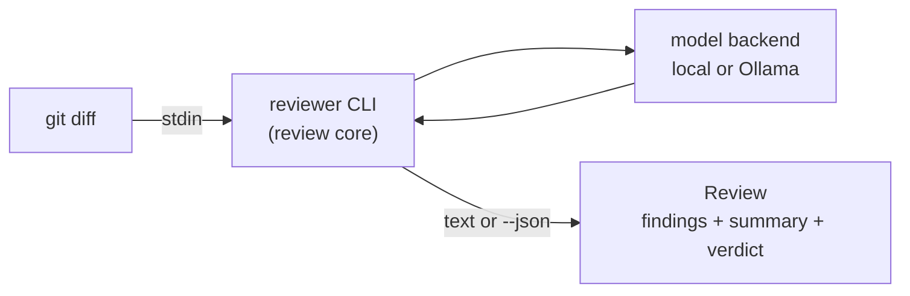

# Code Review Assistant

A small, self-hosted language model that reviews Python and TypeScript diffs —
built primarily as a hands-on project to understand how such models are created
and evaluated, with a genuinely useful local reviewer as the payoff.

> **Status:** **Phase 1 complete.** All eight milestones (M1–M8) shipped
> and ran on real hardware. Headline outcomes recorded in
> [`docs/results.md`](docs/results.md):
> - A from-scratch BPE-encoded ~14 M-param GPT trained on the corpus (M6);
>   samples produce real-looking code memorized from the training set —
>   the "garbage in / garbage out" lesson made vivid.
> - A device-agnostic training loop with byte-identical CPU vs CUDA results
>   and a ~10× speedup on the RTX 5060 Ti (M3).
> - A working `codereview review` CLI talking to `qwen2.5-coder` via Ollama
>   on the workhorse (M7), interactive on the new GPU.
> - A baseline eval score against the off-the-shelf model that any Phase 2
>   candidate must beat (M8): 1.000 recall on security, 0.727 verdict
>   accuracy overall, biased toward false negatives — the clearest
>   Phase 2 fine-tuning target.
>
> **Phase 2 is next:** QLoRA fine-tune of a small pretrained code model
> into the real reviewer, per ADR-001 / ADR-003 / ADR-017. The deferred
> taxonomy + scoring decisions come back to the table now, informed by
> the M8 baseline numbers.

## What it is

Two goals, in priority order:

1. **Learning** — implement a tiny transformer from scratch, then fine-tune a
   small pretrained model, to understand the full lifecycle end to end.
2. **A tool** — a reviewer that runs locally and flags what linters can't: logic
   bugs, missing tests, unclear design, security smells.

It deliberately does **not** try to replace `ruff`/`mypy` or `eslint`/`tsc` —
those already handle style, types, and syntax instantly. This focuses on
judgment-level review.

## How it works

At the core is a single contract, `review(diff) -> Review`, exposed first as a
Unix CLI and later wrapped by git hooks, an editor, or CI. Models run behind a
swappable backend: a local model now, an always-on Ollama service later.



The full diagrams — the two-plane build/serve architecture, the review
lifecycle, the output schema, and the model-promotion flow — live in
[`docs/ARCHITECTURE.md`](docs/ARCHITECTURE.md).

## Usage

```bash
# Review staged changes — talks to qwen2.5-coder via Ollama on workhorse
git diff --staged | uv run python -m codereview review --config configs/review.toml

# Machine-readable output for tooling / the eval harness
git diff --staged | uv run python -m codereview review --config configs/review.toml --json
```

A review returns structured **findings** (each with a severity, category,
message, and optional location and suggested fix), a prose **summary**, and a
pass/fail **verdict** *derived* from the findings' severities. The exit code is
non-zero when a blocking finding is present, so the same command can gate a
pre-commit hook or a CI step. See the architecture doc for the full schema.

## Development

Requires Python 3.12+ and [`uv`](https://github.com/astral-sh/uv).

```bash
uv sync                                       # install from the lockfile
uv run pytest                                 # run the test suite
uv run python -m codereview --help            # top-level CLI

# Train a tiny model on the committed sample data (CI-safe smoke run):
uv run python -m codereview train --config configs/smoke.toml --device cpu

# Sample text from a saved checkpoint:
uv run python -m codereview sample --checkpoint runs/smoke/ckpt.pt \
    --prompt "def " --max-new-tokens 100 --seed 42
```

Phase 1 (the from-scratch model) ran on CPU on `rae-dev-command` and on CUDA
on `rae-dev-workhorse`'s RTX 5060 Ti (Blackwell, swapped in per ADR-021);
Phase 2 fine-tuning runs on a rented GPU. The three-machine split and the
reasoning behind it are in the architecture doc.

## Roadmap

- **Phase 1 — done.** From-scratch track in two steps: a char-level
  ~1 M-param model proving the device-agnostic training loop on both CPU and
  CUDA, then a small-BPE ~14 M-param "baby GPT" as the main learning run.
  Alongside it: the `review()` core + CLI talking to `qwen2.5-coder` via Ollama,
  and the eval harness with the baseline score. The from-scratch model is a
  disposable teaching artifact — not the eventual reviewer. Outcomes in
  [`docs/results.md`](docs/results.md).
- **Phase 2 — next.** QLoRA fine-tune of a small pretrained code model on
  a rented GPU (container smoke-tested locally first), export to GGUF, and
  serve via Ollama on `rae-dev-workhorse`. The deferred ADR-017 items
  (base model, fine-tuning dataset, final taxonomy, scoring methodology)
  come back to the table now, informed by Phase 1's measured baseline.

## Documentation

- [`docs/ARCHITECTURE.md`](docs/ARCHITECTURE.md) — system design and diagrams.
- [`docs/MILESTONES.md`](docs/MILESTONES.md) — Phase 1 work plan: eight
  reviewable increments with acceptance criteria.
- [`docs/SETUP.md`](docs/SETUP.md) — per-machine bootstrap (system layer up to
  `uv sync`).
- [`docs/RUNBOOK.md`](docs/RUNBOOK.md) — end-to-end procedure for the Phase 1
  real-world runs: corpus prep, char-level training on both machines, sampling,
  results-log entry, Ollama setup, and the live `git diff | reviewer`.
- [`docs/REBUILD.md`](docs/REBUILD.md) — one-time day-of playbook for the
  workhorse GPU + PSU swap (ADR-021): physical install → fresh Pop!_OS →
  drivers → cu128 venv → first CUDA run.
- [`docs/tokenizer-comparison.md`](docs/tokenizer-comparison.md) — char vs. BPE
  compression measured on the Phase 1 corpus (the M5 lesson).
- [`docs/results.md`](docs/results.md) — reverse-chronological training results.
  All Phase 1 runs are here (char-level CPU/CUDA, baby-GPT BPE, M8 baseline).
- [`docs/baseline-eval.md`](docs/baseline-eval.md) — the M8 score that any
  Phase 2 candidate must beat (raw harness output).
- [`docs/DECISIONS.md`](docs/DECISIONS.md) — design decisions log (ADRs).
- [`CLAUDE.md`](CLAUDE.md) — operational guide for coding agents; implementation
  is agent-assisted with human review of every diff.

## Data & licensing

Training-data provenance and licenses are tracked deliberately. The full dataset
is **not** committed — only a small sample plus preparation scripts — and large
model artifacts live outside Git. The project itself is licensed under the
[Apache License 2.0](LICENSE) (see ADR-020).
