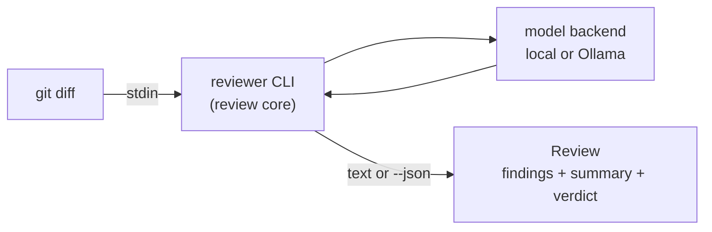

# Code Review Assistant

A small, self-hosted language model that reviews Python and TypeScript diffs —
built primarily as a hands-on project to understand how such models are created
and evaluated, with a genuinely useful local reviewer as the payoff.

> **Status:** Early development / design phase. The architecture and output
> contract are defined; implementation hasn't started. The commands below
> describe the *intended* interface, not yet working code.

## What it is

Two goals, in priority order:

1. **Learning** — implement a tiny transformer from scratch, then fine-tune a
   small pretrained model, to understand the full lifecycle end to end.
2. **A tool** — a reviewer that runs locally and flags what linters can't: logic
   bugs, missing tests, unclear design, security smells.

It deliberately does **not** try to replace `ruff`/`mypy` or `eslint`/`tsc` —
those already handle style, types, and syntax instantly. This focuses on
judgment-level review.

## How it works

At the core is a single contract, `review(diff) -> Review`, exposed first as a
Unix CLI and later wrapped by git hooks, an editor, or CI. Models run behind a
swappable backend: a local model now, an always-on Ollama service later.



The full diagrams — the two-plane build/serve architecture, the review
lifecycle, the output schema, and the model-promotion flow — live in
[`docs/ARCHITECTURE.md`](docs/ARCHITECTURE.md).

## Intended usage

```bash
# Review staged changes (planned)
git diff --staged | reviewer

# Machine-readable output for tooling / the eval harness
git diff --staged | reviewer --json
```

A review returns structured **findings** (each with a severity, category,
message, and optional location and suggested fix), a prose **summary**, and a
pass/fail **verdict** *derived* from the findings' severities. The exit code is
non-zero when a blocking finding is present, so the same command can gate a
pre-commit hook or a CI step. See the architecture doc for the full schema.

## Development

Requires Python and [`uv`](https://github.com/astral-sh/uv):

```bash
uv sync     # install from the lockfile
# CLI, training, and eval entrypoints to follow
```

Phase 1 (the from-scratch model) trains on CPU on `rae-dev-command`, with a
parallel CUDA track on `rae-dev-workhorse`'s GTX 1050; Phase 2 fine-tuning runs
on a rented GPU. The three-machine split and the reasoning behind it are in the
architecture doc.

## Roadmap

- **Phase 1** — the from-scratch track, in two steps: a char-level ~1–3M-param
  model to prove the device-agnostic training loop on both CPU and CUDA, then a
  small-BPE ~10M "baby GPT" as the main learning run (doubling as a CPU-vs-GPU
  benchmark). Alongside it: the `review()` core and CLI, and the evaluation
  harness. The model itself is a disposable teaching artifact, not the eventual
  reviewer.
- **Phase 2** — QLoRA fine-tune of a small pretrained code model on a rented GPU
  (container smoke-tested locally first), export to GGUF, and serve via Ollama on
  `rae-dev-workhorse`.

## Documentation

- [`docs/ARCHITECTURE.md`](docs/ARCHITECTURE.md) — system design and diagrams.
- [`docs/MILESTONES.md`](docs/MILESTONES.md) — Phase 1 work plan: eight
  reviewable increments with acceptance criteria.
- [`docs/SETUP.md`](docs/SETUP.md) — per-machine bootstrap (system layer up to
  `uv sync`).
- [`docs/DECISIONS.md`](docs/DECISIONS.md) — design decisions log (ADRs).
- [`CLAUDE.md`](CLAUDE.md) — operational guide for coding agents; implementation
  is agent-assisted with human review of every diff.

## Data & licensing

Training-data provenance and licenses are tracked deliberately. The full dataset
is **not** committed — only a small sample plus preparation scripts — and large
model artifacts live outside Git. Project license: TBD.
