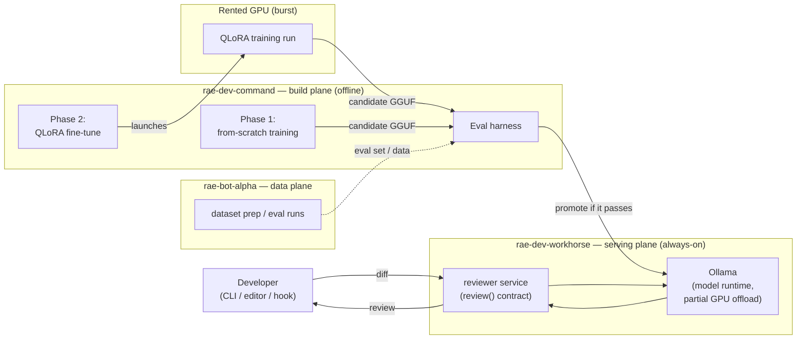
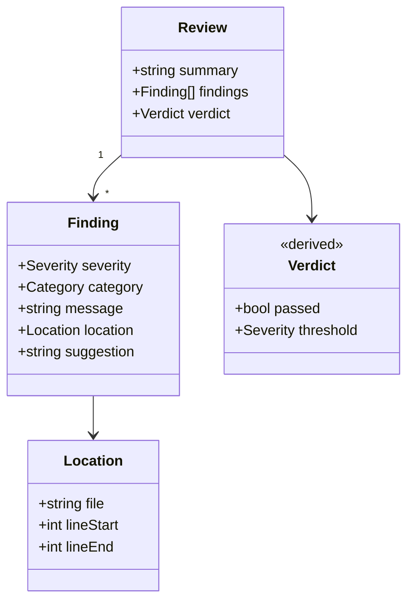
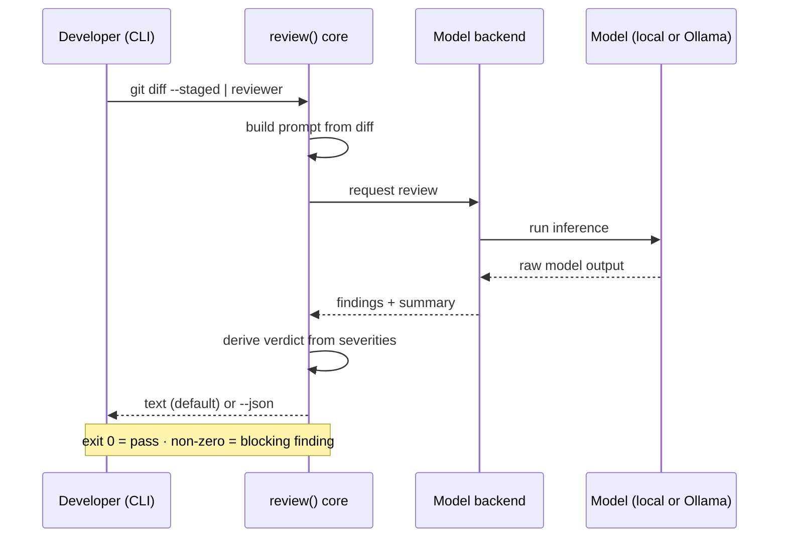
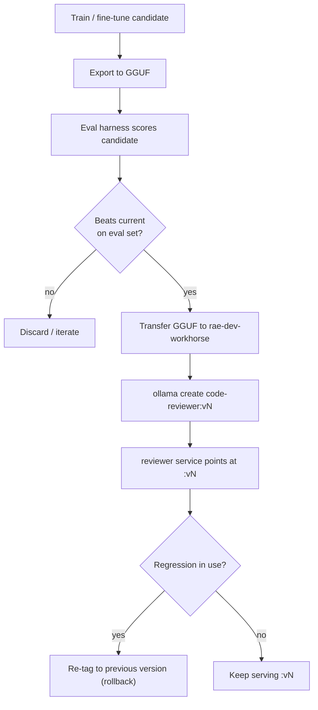

# Code Review Assistant — Architecture & Design

A small language model that assists with Python and TypeScript code reviews. The
project has two aims, in priority order:

1. **Learning** — understand, hands-on, how these models are built and evaluated.
2. **A useful tool** — a working reviewer we actually run day to day.

This document captures the high-level architecture and the design decisions made
so far. Values marked *(proposed)* are defaults open to revision; everything else
reflects a decision already taken.

---

## 1. Hardware and roles

No local machine has a GPU capable of fine-tuning — the only discrete card is a
2 GB GTX 1050 — so Phase 2 training is offloaded to rented hardware. The 1050
is, however, ample for Phase 1's tiny models and for partial inference offload.

| Host | Spec | Role |
| --- | --- | --- |
| `rae-dev-command` | Ryzen 9 9900X (12c/24t), 64 GB | **Build plane** — from-scratch experiments (CPU track), fine-tuning orchestration, eval harness |
| `rae-dev-workhorse` | i7-8700 (6c/12t), 32 GB, GTX 1050 2 GB | **Serving plane** — always-on reviewer (Ollama, partial GPU offload); also the CUDA box: Phase 1 GPU track and local smoke-testing of the cloud training container |
| `rae-bot-alpha` | Ryzen 3 3200G (4c), 64 GB | **Data plane** — dataset prep, curation, eval runs |
| Rented GPU | cloud, burst | Phase 2 QLoRA fine-tuning only |

All three local machines are **x86_64** (Pop!_OS 24.04 ships only that
architecture), so the same lockfile and CPU `torch` wheel resolve identically
on every box — and on GitHub Actions' `ubuntu-latest` CI runner. An aarch64
addition would need a second source mapping in `pyproject.toml`.

The GTX 1050 (Pascal, `sm_61`) sits past PyTorch's support line for current
builds, so the workhorse pins an older PyTorch from the cu126 wheel line in its
lockfile. Inference via llama.cpp/Ollama is unaffected.

### Machine communication

All three machines live on the local network only — no external exposure. Each
flow uses the simplest tool that fits it:

- **Foundation** — cross-installed SSH keys; stable names via router DHCP
  reservations + `/etc/hosts` (or mDNS `.local`), wrapped in `~/.ssh/config`.
- **Code** — syncs through the GitHub remote only (push/pull), never by copying
  working trees. The eval set rides along as versioned text.
- **Artifacts** — explicit `rsync` over SSH for GGUF promotion
  (`command -> workhorse`) and dataset handoffs (`alpha <-> command`).
  Resumable, delta-only, and deliberate — promotion stays an explicit act.
- **Live traffic** — HTTP: Ollama on the workhorse listens on the LAN
  (`OLLAMA_HOST=0.0.0.0`), and remote `review()` backends point at
  `http://workhorse:11434`.
- **Deliberately absent** — no shared filesystem (NFS/Syncthing). Ambient sync
  would undercut eval-gated promotion, and the git-ignored heavy directories are
  intentionally different per machine. Revisit only if a real need appears
  (an NFS export from `alpha` would be the natural shape). Tailscale is the
  noted upgrade path if off-LAN access is ever wanted.

---

## 2. System architecture

The system is split into two planes joined by a single seam: a **model artifact**
(a GGUF file) plus a **stable interface** (`review(diff) -> Review`). The build
plane produces and scores models; the serving plane runs the current one. The
build plane is offline (run when working on the model); the serving plane is
always-on.



---

## 3. The interface seam: `review()`

The invariant of the whole system is a single function the rest wraps:

```
review(diff_or_snippet, config) -> Review
```

Everything that *invokes* the reviewer (the CLI today; a git hook, editor
extension, or CI step later) calls this same core. Everything that *serves* a
model (a local in-process model now; the warm Ollama model on `rae-bot-alpha`
later) sits behind a pluggable **backend** interface chosen by config. Keeping
the logic in this core — and the CLI shell thin — is what lets new integrations
and new model backends be added without a rewrite.

---

## 4. Output contract

A review is a single canonical object with three parts: a list of **findings**,
a freeform **summary**, and a **verdict** that is *derived* from the findings
(not asked of the model separately, so the two can never disagree).



**Optional fields:** `Finding.location` (may be absent or coarse — mapping model
comments back to exact diff lines is unreliable for small models, so it starts
file-level and tightens later), `Finding.suggestion` (a proposed fix; defined now
but likely unfilled until Phase 2), and the line numbers within `Location`.

**Severity** *(proposed)*: `error`, `warning`, `info`.
**Category** *(proposed)*: `bug`, `security`, `performance`, `typing`,
`test-gap`, `design`, `readability`. Categories deliberately skew toward
judgment-level issues — style, type, and syntax problems are left to the existing
linters (`ruff`/`mypy`, `eslint`/`tsc`), which already catch them instantly and
for free. The reviewer earns its keep where those tools can't reach.

**Derived verdict:** `passed` is `false` if any finding meets or exceeds the
configurable `threshold` *(proposed default: `error`)*; otherwise `true`. A clean
review is a first-class result: `passed: true` with an empty `findings` list.

**Renderings:** one structure, two presentations. Human-readable text is the
default (a rendering of the object); `--json` emits the raw object for the eval
harness and future integrations, keeping the two from drifting apart.

### Example

```json
{
  "summary": "Adds retry logic to the API client. Sound overall, but the retry loop can mask a permanent auth failure, and the exhausted-retries path is untested.",
  "findings": [
    {
      "severity": "error",
      "category": "bug",
      "message": "Retries on 401 responses, so an invalid token retries until timeout instead of failing fast.",
      "location": { "file": "src/client.ts", "lineStart": 42, "lineEnd": 48 },
      "suggestion": "Treat 401/403 as non-retryable and surface the error immediately."
    },
    {
      "severity": "warning",
      "category": "test-gap",
      "message": "No test covers the path where all retries are exhausted.",
      "location": { "file": "src/client.ts" }
    }
  ],
  "verdict": { "passed": false, "threshold": "error" }
}
```

---

## 5. Review lifecycle (CLI)

The first interaction model is a Unix-style CLI: a diff in on stdin, a review out
on stdout, diagnostics on stderr, and a meaningful exit code so a future hook or
CI step can gate on it. Other integrations become thin wrappers around the same
core.



---

## 6. Model build and promotion

Phase 1 produces a disposable from-scratch model (a teaching artifact, not the
reviewer). Phase 2 fine-tunes a small pretrained code model on a rented GPU into
the real reviewer — with the training container smoke-tested locally on the
workhorse's GTX 1050 before any rental time is spent. In both cases the eval
harness gates whether a candidate is promoted onto the always-on serving plane,
and Ollama tags give clean versioning and rollback.



---

## 7. Repository and environment

A single monorepo. Git tracks the reproducible core; large and sensitive things
live in the working tree but are git-ignored (or stored externally). The Phase 1
learning loop runs in a `uv` virtual environment; containers are used only at the
seams (the serving stack, and a CUDA image for the rented-GPU step).

```
repo/
├── README.md
├── CLAUDE.md     # agent guide — operational rules distilled from the ADRs
├── docs/         # this doc, decisions log, milestones, setup, eval notes
├── src/          # model, tokenizer, training loop, review() core + backends
├── cli/          # thin CLI shell over review()
├── eval/         # harness + the (small, versioned) eval set
├── data/         # sample + scripts + SOURCES.md committed; full set git-ignored
├── checkpoints/  # git-ignored; regenerated from recipe or stored on HF Hub
├── configs/      # per-experiment hyperparameters
├── serving/      # Compose stack for Ollama + reviewer service
├── tests/        # pytest suite (CI-gated)
├── .github/      # CI: ruff + pytest on every push
├── .env.example  # secrets live in .env (git-ignored)
├── .gitignore
└── uv.lock
```

---

## 8. Open questions

**Near-term:** none — Phase 1 is fully unblocked. Implementation proceeds per
`docs/MILESTONES.md` under the agent workflow (ADR-019).

**Deferred to the Phase 2 boundary (ADR-017):**

- Phase 2 **base model** (e.g. a small Qwen3-Coder variant or Phi-4-mini).
- **Fine-tuning dataset** sourcing, curation, and licensing/provenance handling.
- Final **category taxonomy** and severity **threshold** defaults (the harness
  is built in Phase 1 with the proposed defaults above).
- The precision-aware **eval scoring** methodology.

**Resolved since first draft:** the Phase 1 model/tokenizer/config spec
(ADR-016: char-level ~1–3M first, then small-BPE ~10M baby-GPT, device-agnostic,
fp32, doubling as a CPU-vs-GPU benchmark), the GGUF transfer mechanism
(ADR-015: `rsync` over SSH), the Phase 1 pretraining corpus (ADR-018: own
repos + a permissively licensed public slice, provenance in `data/SOURCES.md`),
and the project license (ADR-020: Apache 2.0).
